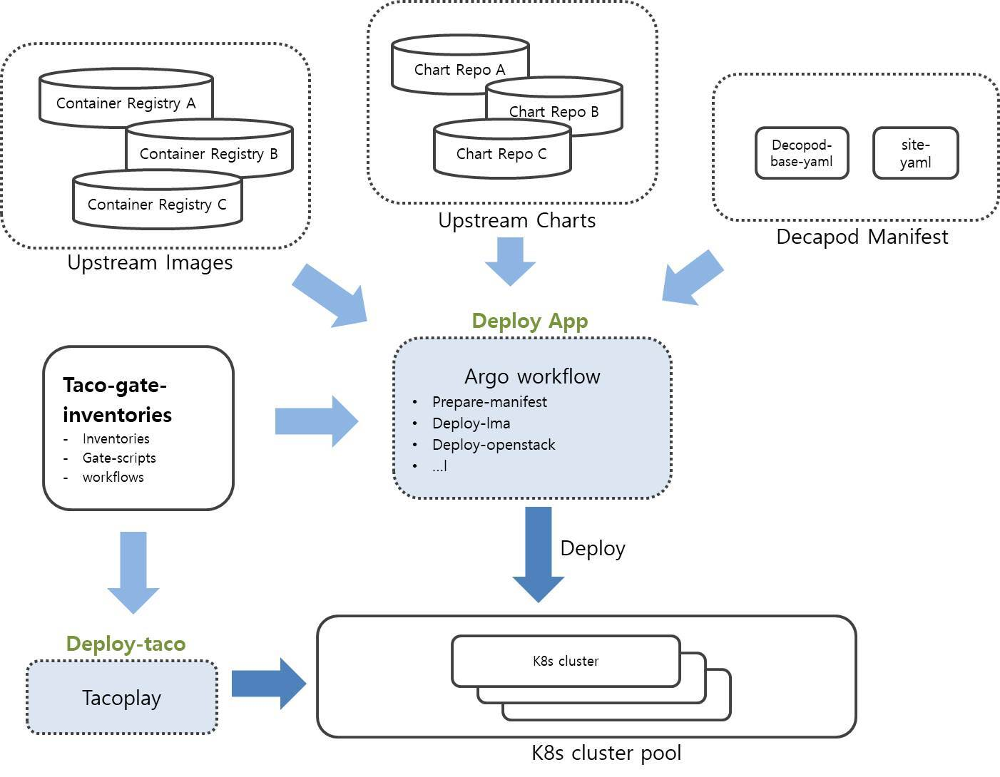

# CI / CD

### Overview
HANU의 CI/CD pipeline 은 Taco 및 관련 인프라, application 등을 빌드, 배포, 테스트하는 일련의 단계들로 구성되어 있으며, SKT에서 기존에 사용하던 Jenkins 기반의 CI 체계를 참고하여 github 환경에 맞게 새롭게 구성하였습니다. 자체개발한 tacoplay라는 ansible playbook을 사용해 taco cluster를 배포하고, 그 위에 logging/monitoring toolchain, openstack cloud platform을 비롯한 여러 application 등을 배포하고 검증하는 flow로 이루어져 있습니다.

Application 배포를 위해서 decapod라는 배포 체계를 사용하게 되며, 각 application 별 배포 설정은 yaml 포맷의 manifest로 관리됩니다.

모든 코드 수정은 pull request 형태로 제출되어, 기본적인 테스트를 거친 후 human review를 거쳐 main branch에 반영되며, 각각의 컴포넌트 별 테스트 외에 주기적으로 여러 컴포넌트들이 결합되어 수행되는 통합 테스트를 거치게 됩니다.

 

### Overall Flow
</img> 

- Deploy-taco job은 주기적으로 kubernetes cluster의 배포를 테스트하며, 배포 성공시 새롭게 배포된 kubernetes cluster를 cluster pool에 계속 추가합니다. Tacoplay repositoy에 새로운 PR(pull request)이 제출될 경우에도 최소한의 배포 테스트를 거친 후에 수정한 내용이 main branch에 merge됩니다.
- Decapod-site-yaml 또는 hanu-site-yaml repository에 새로운 PR이 제출될 경우, lint-decapod-yaml job이 자동으로 수행되며, lint test 등 최소한의 validation 작업을 거친 후 수정한 내용이 main branch에 merge됩니다.
- 실제로 application을 배포하는 deploy-apps job의 경우, kubernetes cluster pool 에서 random으로 cluster를 할당 받은 후 upstream charts와 image, 그리고 앞에서 준비된 decapod yaml 파일을 사용하여 application 배포를 수행하게 됩니다.

 

### Job Type
테스트는 job의 성격에 따라 jenkins job 또는 github action의 형태로 수행됩니다.

- Jenkins job 형태로 수행되는 프로젝트의 경우, 최상위 디렉토리의 Jenkinsfile이라는 파일에 의해 job이 정의되며, (Eg, https://github.com/openinfradev/tacoplay/blob/main/Jenkinsfile)
- github action의 경우 '.github/workflows' 라는 파일에 job 내용이 정의됩니다. (Eg, https://github.com/openinfradev/kustomize-helm-transformer/blob/main/.github/workflows/run-kustomize.yml)

 

### 주요 Job List
현재 개발 또는 동작 중인 주요 job들은 다음과 같습니다.

| Job명              | Repository명                                                               |  설명                                         | 타입 
|--------------------|----------------------------------------------------------------------------|-----------------------------------------------|------------
| deploy-taco        | [tacoplay](https://github.com/openinfradev/tacoplay/blob/main/Jenkinsfile) | tacoplay playbook을 사용하여 taco cluster 배포| Jenkins job
| deploy-apps        | hanu-site-yaml (private) | decapod toolset 을 사용하여 taco 클러스터 위에 application 배포 (openstack, LMA 등)             | Jenkins job
| lint-decapod-yaml  | hanu-site-yaml (private) | (common한 내용을 담고 있는) base yaml과 site yaml를 조합시 오류가 없는지 검증                   | Github action
| promote (release)  | [hanu-ci-jobs](https://github.com/openinfradev/hanu-ci-jobs/blob/main/promote/Jenkinsfile) | 통합테스트 등 검증 완료 후 version release | Jenkins job
| validate-XXX       | [hanu-ci-jobs] (TBU)                                             | kubernetes 및 기타 application들이 정상 동작하는지 검증 | Jenkins job
